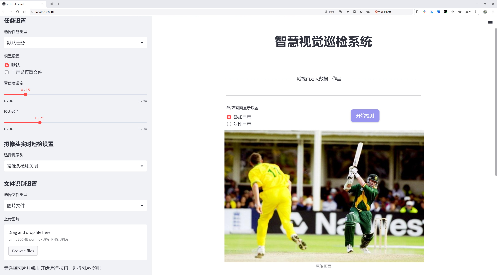
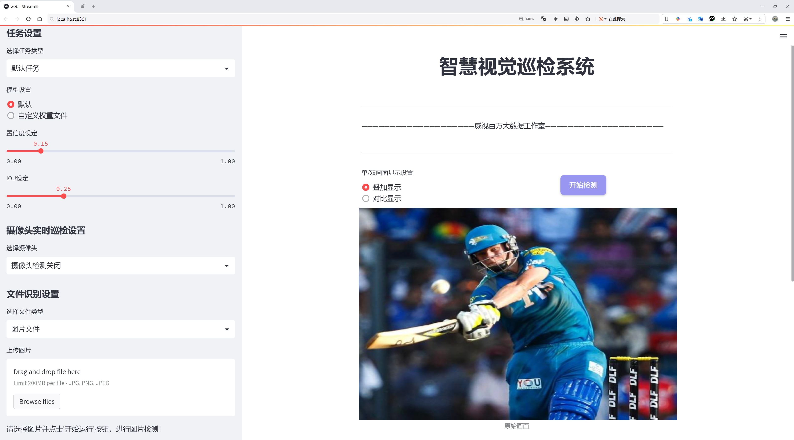
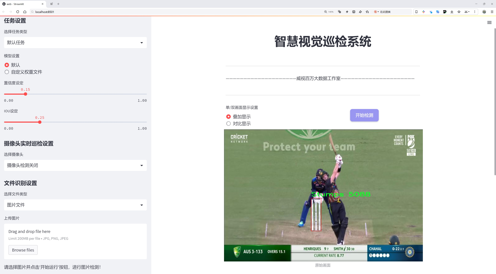
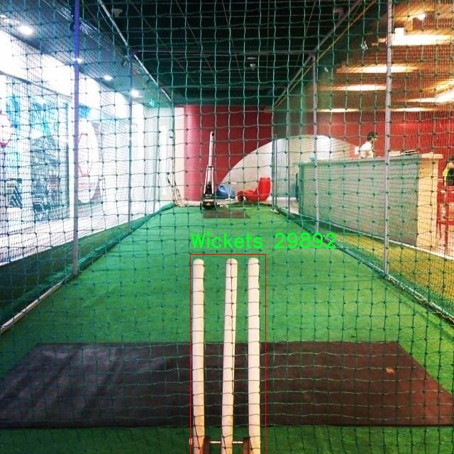
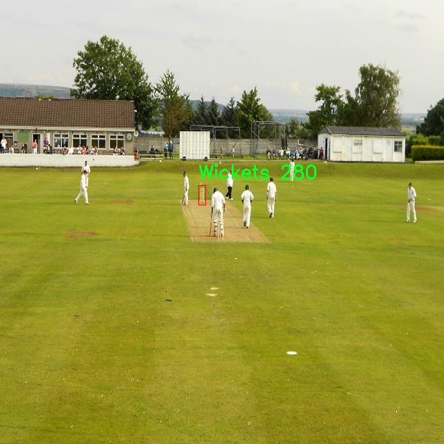
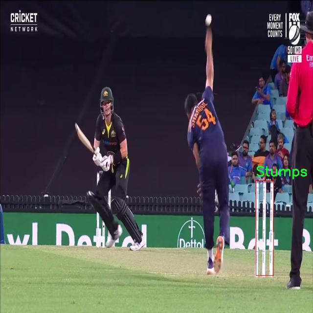
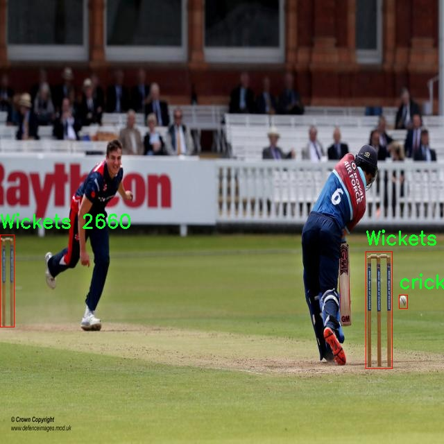
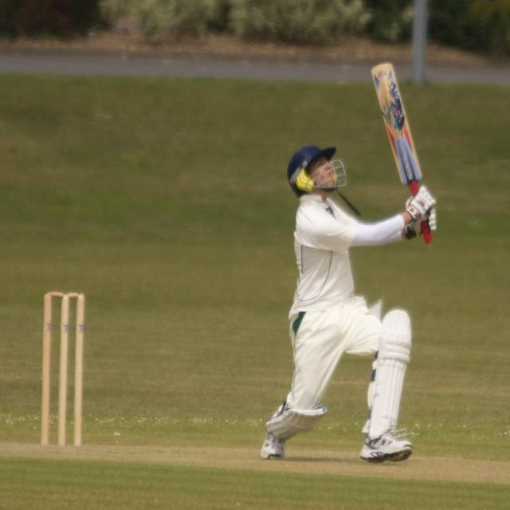

# 棒球场景检测系统源码分享
 # [一条龙教学YOLOV8标注好的数据集一键训练_70+全套改进创新点发刊_Web前端展示]

### 1.研究背景与意义

项目参考[AAAI Association for the Advancement of Artificial Intelligence](https://gitee.com/qunmasj/projects)

项目来源[AACV Association for the Advancement of Computer Vision](https://kdocs.cn/l/cszuIiCKVNis)

研究背景与意义

随着计算机视觉技术的迅猛发展，物体检测在各个领域的应用越来越广泛，尤其是在体育赛事分析中，实时、准确的场景检测系统成为提升观众体验和赛事管理效率的重要工具。棒球作为一项全球广受欢迎的运动，其比赛场景中包含了丰富的动态信息，如何有效地识别和分析比赛中的关键元素，如击球手、球、球门等，成为了研究者们关注的焦点。传统的手动分析方法不仅耗时耗力，而且容易受到人为因素的影响，无法实现高效、准确的实时监控。因此，基于深度学习的自动化检测系统应运而生，成为解决这一问题的有效途径。

YOLO（You Only Look Once）系列模型因其在物体检测任务中的高效性和准确性而受到广泛关注。YOLOv8作为该系列的最新版本，进一步提升了检测速度和精度，尤其在复杂场景下的表现尤为突出。然而，尽管YOLOv8在许多应用中取得了良好的效果，但在特定场景下，尤其是棒球场景的检测任务中，仍然存在一些挑战。比如，比赛过程中快速移动的球体、复杂的背景以及不同类别物体之间的相互遮挡，都会对检测系统的性能造成影响。因此，改进YOLOv8以适应棒球场景的特定需求，成为本研究的重要目标。

本研究将基于改进YOLOv8模型，构建一个专门针对棒球场景的检测系统。我们将利用一个包含600张图像的棒球数据集，该数据集涵盖了6个主要类别：击球手、球门、球、板球、球和桩。这些类别不仅是比赛中关键的组成部分，也是分析比赛进程和结果的重要依据。通过对这些类别的精准识别，能够为教练、运动员和观众提供实时的数据支持，帮助他们更好地理解比赛动态。

本研究的意义在于，不仅为棒球赛事的实时分析提供了一种新的技术手段，也为其他体育项目的场景检测提供了借鉴。通过改进YOLOv8，我们期望能够在提高检测精度的同时，缩短处理时间，实现实时反馈。此外，本研究还将探索数据增强、迁移学习等技术在模型训练中的应用，以提升模型在复杂场景下的鲁棒性和适应性。

综上所述，基于改进YOLOv8的棒球场景检测系统的研究，不仅具有重要的理论价值，也具备广泛的实际应用前景。通过这一研究，我们希望能够推动体育赛事分析技术的发展，为相关领域的研究提供新的思路和方法，同时为体育产业的数字化转型贡献力量。

### 2.图片演示







##### 注意：由于此博客编辑较早，上面“2.图片演示”和“3.视频演示”展示的系统图片或者视频可能为老版本，新版本在老版本的基础上升级如下：（实际效果以升级的新版本为准）

  （1）适配了YOLOV8的“目标检测”模型和“实例分割”模型，通过加载相应的权重（.pt）文件即可自适应加载模型。

  （2）支持“图片识别”、“视频识别”、“摄像头实时识别”三种识别模式。

  （3）支持“图片识别”、“视频识别”、“摄像头实时识别”三种识别结果保存导出，解决手动导出（容易卡顿出现爆内存）存在的问题，识别完自动保存结果并导出到tempDir中。

  （4）支持Web前端系统中的标题、背景图等自定义修改，后面提供修改教程。

  另外本项目提供训练的数据集和训练教程,暂不提供权重文件（best.pt）,需要您按照教程进行训练后实现图片演示和Web前端界面演示的效果。

### 3.视频演示

[3.1 视频演示](https://www.bilibili.com/video/BV1pm2uYRE3R/)

### 4.数据集信息展示

##### 4.1 本项目数据集详细数据（类别数＆类别名）

nc: 6
names: ['Batsman', 'Stumps', 'Wickets', 'ball', 'cricket-ball', 'stump']


##### 4.2 本项目数据集信息介绍

数据集信息展示

在现代计算机视觉领域，数据集的构建与应用是推动算法进步的重要基石。为改进YOLOv8的棒球场景检测系统，我们选用了名为“Cricket”的数据集，该数据集专注于捕捉和识别与板球相关的各种元素，旨在为模型提供丰富的训练样本，以提升其在实际应用中的准确性和鲁棒性。

“Cricket”数据集包含六个主要类别，分别是：Batsman（击球手）、Stumps（门柱）、Wickets（击球器）、ball（球）、cricket-ball（板球）和stump（支柱）。这些类别的选择反映了板球比赛中关键的视觉元素，确保模型能够有效地识别和定位比赛中的重要对象。每个类别都承载着特定的语义信息，帮助模型在复杂的场景中进行精准的目标检测。

在数据集的构建过程中，研究团队采用了多种数据采集技术，包括高分辨率摄像机录制的比赛视频、专业摄影师拍摄的静态图像以及来自不同比赛场景的多样化样本。这种多样化的数据来源确保了数据集的丰富性和代表性，使得模型在训练时能够接触到不同的光照条件、视角变化和场景复杂性，从而提高其泛化能力。

每个类别的标注工作也经过了严格的审核和校正，确保标注的准确性。通过使用先进的标注工具，研究人员能够为每个图像中的目标提供精确的边界框和类别标签。这一过程不仅提升了数据集的质量，也为后续的模型训练打下了坚实的基础。

在数据集的规模方面，“Cricket”数据集涵盖了数千张图像，确保了每个类别都有足够的样本量供模型学习。通过对数据集的合理划分，研究团队将数据分为训练集、验证集和测试集，以便在模型训练和评估过程中进行有效的性能监测。这种划分策略使得模型在训练时能够充分利用数据，同时在验证和测试阶段保持客观性，避免过拟合现象的发生。

此外，为了增强模型的鲁棒性，研究团队还对数据集进行了数据增强处理，包括随机裁剪、旋转、缩放和颜色变换等。这些技术的应用使得模型在面对不同的场景和条件时，能够保持良好的检测性能，进一步提升了其在实际应用中的适应能力。

总之，“Cricket”数据集为改进YOLOv8的棒球场景检测系统提供了一个坚实的基础。通过对数据集的精心设计与构建，我们期望能够训练出一个在复杂场景中表现优异的目标检测模型，为板球比赛的分析、裁判辅助和观众体验提升等应用场景提供强有力的技术支持。随着研究的深入和技术的不断进步，期待“Cricket”数据集能够为板球领域的计算机视觉研究带来更多的启示与突破。











### 5.全套项目环境部署视频教程（零基础手把手教学）

[5.1 环境部署教程链接（零基础手把手教学）](https://www.ixigua.com/7404473917358506534?logTag=c807d0cbc21c0ef59de5)


[5.2 安装Python虚拟环境创建和依赖库安装视频教程链接（零基础手把手教学）](https://www.ixigua.com/7404474678003106304?logTag=1f1041108cd1f708b01a)

### 6.手把手YOLOV8训练视频教程（零基础小白有手就能学会）

[6.1 手把手YOLOV8训练视频教程（零基础小白有手就能学会）](https://www.ixigua.com/7404477157818401292?logTag=d31a2dfd1983c9668658)


按照上面的训练视频教程链接加载项目提供的数据集，运行train.py即可开始训练



     Epoch   gpu_mem       box       obj       cls    labels  img_size
     1/200     20.8G   0.01576   0.01955  0.007536        22      1280: 100%|██████████| 849/849 [14:42<00:00,  1.04s/it]
               Class     Images     Labels          P          R     mAP@.5 mAP@.5:.95: 100%|██████████| 213/213 [01:14<00:00,  2.87it/s]
                 all       3395      17314      0.994      0.957      0.0957      0.0843

     Epoch   gpu_mem       box       obj       cls    labels  img_size
     2/200     20.8G   0.01578   0.01923  0.007006        22      1280: 100%|██████████| 849/849 [14:44<00:00,  1.04s/it]
               Class     Images     Labels          P          R     mAP@.5 mAP@.5:.95: 100%|██████████| 213/213 [01:12<00:00,  2.95it/s]
                 all       3395      17314      0.996      0.956      0.0957      0.0845

     Epoch   gpu_mem       box       obj       cls    labels  img_size
     3/200     20.8G   0.01561    0.0191  0.006895        27      1280: 100%|██████████| 849/849 [10:56<00:00,  1.29it/s]
               Class     Images     Labels          P          R     mAP@.5 mAP@.5:.95: 100%|███████   | 187/213 [00:52<00:00,  4.04it/s]
                 all       3395      17314      0.996      0.957      0.0957      0.0845


### 7.70+种全套YOLOV8创新点代码加载调参视频教程（一键加载写好的改进模型的配置文件）

[7.1 70+种全套YOLOV8创新点代码加载调参视频教程（一键加载写好的改进模型的配置文件）](https://www.ixigua.com/7404478314661806627?logTag=29066f8288e3f4eea3a4)

### 8.70+种全套YOLOV8创新点原理讲解（非科班也可以轻松写刊发刊，V10版本正在科研待更新）

#### 由于篇幅限制，每个创新点的具体原理讲解就不一一展开，具体见下列网址中的创新点对应子项目的技术原理博客网址【Blog】：


[8.1 70+种全套YOLOV8创新点原理讲解链接](https://gitee.com/qunmasj/good)

#### 部分改进原理讲解(完整的改进原理见上图和技术博客链接)【如果此小节的图加载失败可以通过CSDN或者Github搜索该博客的标题访问原始博客，原始博客图片显示正常】

### YOLOv8简介


由上图可以看出，C2中每个BottlNeck的输入Tensor的通道数channel都只是上一级的0.5倍，因此计算量明显降低。从另一方面讲，梯度流的增加，t也能够明显提升收敛速度和收敛效果。
C2i模块首先以输入tensor(n.c.h.w)经过Conv1层进行split拆分，分成两部分(n,0.5c,h,w)，一部分直接经过n个Bottlenck，另一部分经过每一操作层后都会以(n.0.5c,h,w)的尺寸进行Shortcut，最后通过Conv2层卷积输出。也就是对应n+2的Shortcut(第一层Conv1的分支tensor和split后的tensor为2+n个bottenlenneck)。
#### Neck
YOLOv8的Neck采用了PANet结构，如下图所示。

Backbone最后SPPF模块(Layer9)之后H、W经过32倍下采样，对应地Layer4经过8倍下采样，Layer6经过16倍下采样。输入图片分辨率为640*640，得到Layer4、Layer6、Layer9的分辨率分别为80*80、40*40和20*20。
Layer4、Layer6、Layer9作为PANet结构的输入，经过上采样，通道融合，最终将PANet的三个输出分支送入到Detect head中进行Loss的计算或结果解算。
与FPN(单向，自上而下)不同的是，PANet是一个双向通路网络，引入了自下向上的路径，使得底层信息更容易传递到顶层。
#### Head
Head部分相比Yolov5改动较大，直接将耦合头改为类似Yolo的解耦头结构(Decoupled-Head)，将回归分支和预测分支分离，并针对回归分支使用了Distribution Focal Loss策略中提出的积分形式表示法。之前的目标检测网络将回归坐标作为一个确定性单值进行预测，DFL将坐标转变成一个分布。


### LSKNet的架构
该博客提出的结构层级依次为：

LSK module（大核卷积序列+空间选择机制） < LSK Block （LK Selection + FFN）<LSKNet（N个LSK Block）


#### LSK 模块

LSK Block
LSKNet 是主干网络中的一个可重复堆叠的块（Block），每个LSK Block包括两个残差子块，即大核选择子块（Large Kernel Selection，LK Selection）和前馈网络子块（Feed-forward Network ，FFN），如图8。LK Selection子块根据需要动态地调整网络的感受野，FFN子块用于通道混合和特征细化，由一个全连接层、一个深度卷积、一个 GELU 激活和第二个全连接层组成。

LSK module（LSK 模块，图4）由一个大核卷积序列（large kernel convolutions）和一个空间核选择机制（spatial kernel selection mechanism）组成，被嵌入到了LSK Block 的 LK Selection子块中。

#### Large Kernel Convolutions
因为不同类型的目标对背景信息的需求不同，这就需要模型能够自适应选择不同大小的背景范围。因此，作者通过解耦出一系列具有大卷积核、且不断扩张的Depth-wise 卷积，构建了一个更大感受野的网络。

具体地，假设序列中第i个Depth-wise 卷积核的大小为 ，扩张率为 d，感受野为 ，它们满足以下关系：


卷积核大小和扩张率的增加保证了感受野能够快速增大。此外，我们设置了扩张率的上限，以保证扩张卷积不会引入特征图之间的差距。


Table2的卷积核大小可根据公式（1）和（2）计算，详见下图：


这样设计的好处有两点。首先，能够产生具有多种不同大小感受野的特征，便于后续的核选择；第二，序列解耦比简单的使用一个大型卷积核效果更好。如上图表2所示，解耦操作相对于标准的大型卷积核，有效地将低了模型的参数量。

为了从输入数据  的不同区域获取丰富的背景信息特征，可采用一系列解耦的、不用感受野的Depth-wise 卷积核：


其中，是卷积核为 、扩张率为  的Depth-wise 卷积操作。假设有个解耦的卷积核，每个卷积操作后又要经过一个的卷积层进行空间特征向量的通道融合。


之后，针对不同的目标，可基于获取的多尺度特征，通过下文中的选择机制动态选择合适的卷积核大小。

这一段的意思可以简单理解为：

把一个大的卷积核拆成了几个小的卷积核，比如一个大小为5，扩张率为1的卷积核加上一个大小为7，扩张率为3的卷积核，感受野为23，与一个大小为23，扩张率为1的卷积核的感受野是一样的。因此可用两个小的卷积核替代一个大的卷积核，同理一个大小为29的卷积核也可以用三个小的卷积代替（Table 2），这样可以有效的减少参数，且更灵活。

将输入数据依次通过这些小的卷积核（公式3），并在每个小的卷积核后面接上一个1×1的卷积进行通道融合（公式4）。

#### Spatial Kernel Selection
为了使模型更关注目标在空间上的重点背景信息，作者使用空间选择机制从不同尺度的大卷积核中对特征图进行空间选择。

首先，将来自于不同感受野卷积核的特征进行concate拼接，然后，应用通道级的平均池化和最大池化提取空间关系，其中， 和  是平均池化和最大池化后的空间特征描述符。为了实现不同空间描述符的信息交互，作者利用卷积层将空间池化特征进行拼接，将2个通道的池化特征转换为N个空间注意力特征图，之后，将Sigmoid激活函数应用到每一个空间注意力特征图，可获得每个解耦的大卷积核所对应的独立的空间选择掩膜，又然后，将解耦后的大卷积核序列的特征与对应的空间选择掩膜进行加权处理，并通过卷积层进行融合获得注意力特征 ，最后LSK module的输出可通过输入特征  与注意力特征  的逐元素点成获得，公式对应于结构图上的操作如下：


### 9.系统功能展示（检测对象为举例，实际内容以本项目数据集为准）

图9.1.系统支持检测结果表格显示

  图9.2.系统支持置信度和IOU阈值手动调节

  图9.3.系统支持自定义加载权重文件best.pt(需要你通过步骤5中训练获得)

  图9.4.系统支持摄像头实时识别

  图9.5.系统支持图片识别

  图9.6.系统支持视频识别

  图9.7.系统支持识别结果文件自动保存

  图9.8.系统支持Excel导出检测结果数据


### 10.原始YOLOV8算法原理

原始YOLOv8算法原理

YOLOv8（You Only Look Once version 8）是目标检测领域的一项重要进展，标志着YOLO系列模型的又一次重大升级。自2015年首次提出以来，YOLO模型经历了多个版本的迭代，每一次更新都在精度、速度和易用性等方面取得了显著的提升。YOLOv8于2023年由Ultralytics发布，综合了前几代YOLO模型的优点，尤其是吸收了YOLOX、YOLOv6、YOLOv7和PP-YOLOE等算法的设计理念，进一步推动了实时目标检测技术的发展。

YOLOv8的网络结构由三个主要部分组成：Backbone、Neck和Head。这种分层结构使得模型在特征提取、特征融合和目标检测等方面能够高效协同工作。Backbone部分负责从输入图像中提取多层次的特征，采用了一系列卷积和反卷积层，结合残差连接和瓶颈结构，旨在减小网络的复杂度并提升性能。具体而言，Backbone使用了C2模块作为基本构成单元，包含5个CBS模块、4个C2f模块以及1个快速空间金字塔池化（SPPF）模块。这种设计不仅提高了特征提取的效率，还增强了模型对不同尺度目标的适应能力。

在特征提取完成后，Neck部分通过多尺度特征融合技术，将来自Backbone不同阶段的特征图进行整合。这一过程至关重要，因为目标检测往往需要处理不同大小和形状的物体。通过有效地融合多层次的特征，Neck能够更好地捕捉到不同尺度目标的信息，从而显著提高了目标检测的性能和鲁棒性。这种特征融合的策略，使得YOLOv8在复杂场景下的目标检测能力得到了进一步提升。

Head部分则是YOLOv8的核心，负责最终的目标检测和分类任务。该部分设有三个解耦的检测头，能够在不同的尺寸信息下进行目标检测。每个检测头都包含一系列卷积层和反卷积层，利用前面提取的特征生成最终的检测结果。通过这种设计，YOLOv8能够在处理复杂场景时，快速而准确地识别出目标，并为每个目标分配相应的类别标签和置信度。

值得注意的是，YOLOv8在模型的设置上也提供了灵活性。它包括五种不同的网络结构：YOLOv8n、YOLOv8s、YOLOv8m、YOLOv8l和YOLOv8x。这些结构的主要区别在于Backbone的深度和宽度，以及残差块的数量。通过调整depth_factor、width_factor和ratio等参数，用户可以根据具体应用需求，选择合适的模型配置。这种灵活性使得YOLOv8能够适应不同的硬件环境和应用场景，进一步提升了其在目标检测任务中的实用性。

在YOLOv8的设计中，模型的高效性和易用性得到了充分考虑。与前几代YOLO模型相比，YOLOv8不仅在推理速度上更快，精度也得到了显著提升。此外，YOLOv8原生支持自定义数据集的训练，使得用户能够更方便地根据特定需求进行模型调整和优化。这一特点，使得YOLOv8在工业界和学术界都得到了广泛的关注和应用。

总的来说，YOLOv8作为一款SOTA（State Of The Art）模型，凭借其卓越的性能和灵活的设计，正在成为目标检测领域的主流选择。其高效的特征提取、融合和检测机制，使得YOLOv8在实时目标检测任务中表现出色，能够为各种应用场景提供强有力的支持。随着YOLOv8的不断发展和完善，未来在智能监控、自动驾驶、机器人视觉等领域的应用前景将更加广阔。


### 11.项目核心源码讲解（再也不用担心看不懂代码逻辑）

#### 11.1 code\ultralytics\models\sam\amg.py

以下是代码中最核心的部分，并附上详细的中文注释：

```python
import torch
import numpy as np
from itertools import product
import math

def is_box_near_crop_edge(
    boxes: torch.Tensor, crop_box: List[int], orig_box: List[int], atol: float = 20.0
) -> torch.Tensor:
    """
    判断给定的边界框是否接近裁剪边缘。

    参数:
    boxes: 需要判断的边界框，形状为 (N, 4)，N为边界框数量。
    crop_box: 当前裁剪框的坐标 [x0, y0, x1, y1]。
    orig_box: 原始图像的边界框坐标 [x0, y0, x1, y1]。
    atol: 允许的绝对误差，默认为20.0。

    返回:
    返回一个布尔张量，指示每个边界框是否接近裁剪边缘。
    """
    crop_box_torch = torch.as_tensor(crop_box, dtype=torch.float, device=boxes.device)
    orig_box_torch = torch.as_tensor(orig_box, dtype=torch.float, device=boxes.device)
    boxes = uncrop_boxes_xyxy(boxes, crop_box).float()  # 将裁剪框内的边界框转换为原始坐标系
    near_crop_edge = torch.isclose(boxes, crop_box_torch[None, :], atol=atol, rtol=0)  # 判断是否接近裁剪框
    near_image_edge = torch.isclose(boxes, orig_box_torch[None, :], atol=atol, rtol=0)  # 判断是否接近原始图像边缘
    near_crop_edge = torch.logical_and(near_crop_edge, ~near_image_edge)  # 取交集，排除接近原始图像边缘的框
    return torch.any(near_crop_edge, dim=1)  # 返回每个框是否接近裁剪边缘的布尔值

def generate_crop_boxes(
    im_size: Tuple[int, ...], n_layers: int, overlap_ratio: float
) -> Tuple[List[List[int]], List[int]]:
    """
    生成不同大小的裁剪框列表。

    参数:
    im_size: 图像的尺寸 (高度, 宽度)。
    n_layers: 裁剪层数。
    overlap_ratio: 重叠比例。

    返回:
    裁剪框的列表和对应的层索引。
    """
    crop_boxes, layer_idxs = [], []
    im_h, im_w = im_size
    short_side = min(im_h, im_w)

    # 添加原始图像的裁剪框
    crop_boxes.append([0, 0, im_w, im_h])
    layer_idxs.append(0)

    def crop_len(orig_len, n_crops, overlap):
        """计算裁剪框的长度。"""
        return int(math.ceil((overlap * (n_crops - 1) + orig_len) / n_crops))

    for i_layer in range(n_layers):
        n_crops_per_side = 2 ** (i_layer + 1)  # 每层的裁剪框数量
        overlap = int(overlap_ratio * short_side * (2 / n_crops_per_side))  # 计算重叠长度

        crop_w = crop_len(im_w, n_crops_per_side, overlap)  # 计算裁剪框宽度
        crop_h = crop_len(im_h, n_crops_per_side, overlap)  # 计算裁剪框高度

        crop_box_x0 = [int((crop_w - overlap) * i) for i in range(n_crops_per_side)]
        crop_box_y0 = [int((crop_h - overlap) * i) for i in range(n_crops_per_side)]

        # 生成裁剪框
        for x0, y0 in product(crop_box_x0, crop_box_y0):
            box = [x0, y0, min(x0 + crop_w, im_w), min(y0 + crop_h, im_h)]
            crop_boxes.append(box)
            layer_idxs.append(i_layer + 1)

    return crop_boxes, layer_idxs

def uncrop_boxes_xyxy(boxes: torch.Tensor, crop_box: List[int]) -> torch.Tensor:
    """
    将裁剪框内的边界框转换为原始坐标系。

    参数:
    boxes: 裁剪框内的边界框，形状为 (N, 4)。
    crop_box: 当前裁剪框的坐标 [x0, y0, x1, y1]。

    返回:
    转换后的边界框，形状为 (N, 4)。
    """
    x0, y0, _, _ = crop_box
    offset = torch.tensor([[x0, y0, x0, y0]], device=boxes.device)  # 计算偏移量
    if len(boxes.shape) == 3:  # 检查是否有通道维度
        offset = offset.unsqueeze(1)
    return boxes + offset  # 将偏移量加到边界框上

def batched_mask_to_box(masks: torch.Tensor) -> torch.Tensor:
    """
    计算掩码周围的边界框，返回XYXY格式的边界框。

    参数:
    masks: 输入掩码，形状为 CxHxW。

    返回:
    形状为 Cx4 的边界框张量。
    """
    if torch.numel(masks) == 0:  # 如果掩码为空，返回零框
        return torch.zeros(*masks.shape[:-2], 4, device=masks.device)

    shape = masks.shape
    h, w = shape[-2:]
    masks = masks.flatten(0, -3) if len(shape) > 2 else masks.unsqueeze(0)  # 规范化形状为 CxHxW

    # 获取上下边缘
    in_height, _ = torch.max(masks, dim=-1)
    in_height_coords = in_height * torch.arange(h, device=in_height.device)[None, :]
    bottom_edges, _ = torch.max(in_height_coords, dim=-1)
    in_height_coords = in_height_coords + h * (~in_height)
    top_edges, _ = torch.min(in_height_coords, dim=-1)

    # 获取左右边缘
    in_width, _ = torch.max(masks, dim=-2)
    in_width_coords = in_width * torch.arange(w, device=in_width.device)[None, :]
    right_edges, _ = torch.max(in_width_coords, dim=-1)
    in_width_coords = in_width_coords + w * (~in_width)
    left_edges, _ = torch.min(in_width_coords, dim=-1)

    # 如果掩码为空，替换为 [0, 0, 0, 0]
    empty_filter = (right_edges < left_edges) | (bottom_edges < top_edges)
    out = torch.stack([left_edges, top_edges, right_edges, bottom_edges], dim=-1)
    out = out * (~empty_filter).unsqueeze(-1)

    return out.reshape(*shape[:-2], 4) if len(shape) > 2 else out[0  # 返回到原始形状
```

### 代码核心部分说明：
1. **`is_box_near_crop_edge`**: 判断边界框是否接近裁剪框的边缘。
2. **`generate_crop_boxes`**: 生成不同大小的裁剪框，支持多层裁剪。
3. **`uncrop_boxes_xyxy`**: 将裁剪框内的边界框转换为原始图像坐标系。
4. **`batched_mask_to_box`**: 从掩码中计算出边界框，返回XYXY格式的边界框。

这些函数是实现目标检测和图像处理中的关键步骤，能够帮助我们处理图像中的边界框和掩码。

这个文件 `amg.py` 是 Ultralytics YOLO 项目的一部分，主要涉及图像处理和掩膜（mask）相关的功能。代码中定义了一系列函数，用于处理图像中的边界框、掩膜和点网格等。以下是对代码的逐行分析和说明。

首先，文件导入了一些必要的库，包括数学库 `math`、迭代工具 `itertools`、类型提示相关的模块，以及 `numpy` 和 `torch`，后者是用于深度学习的主要库。

`is_box_near_crop_edge` 函数用于判断给定的边界框是否接近裁剪边缘。它接受边界框、裁剪框和原始框的坐标，并通过计算它们之间的距离来判断是否接近。返回值是一个布尔张量，指示每个边界框是否接近裁剪边缘。

`batch_iterator` 函数是一个生成器，用于按批次迭代输入数据。它确保所有输入参数的长度相同，并根据指定的批次大小生成数据批次。

`calculate_stability_score` 函数计算一组掩膜的稳定性分数。稳定性分数是通过对掩膜进行阈值处理得到的二进制掩膜之间的交并比（IoU）来计算的。

`build_point_grid` 函数生成一个二维网格，网格中的点均匀分布在 [0,1] x [0,1] 的范围内。这个函数对于后续的图像处理和分析非常有用。

`build_all_layer_point_grids` 函数生成所有裁剪层的点网格。它根据每层的缩放比例生成不同大小的点网格。

`generate_crop_boxes` 函数生成不同大小的裁剪框。每一层的裁剪框数量是基于层级的指数增长，并考虑重叠比例。该函数返回裁剪框的列表和对应的层索引。

`uncrop_boxes_xyxy` 函数用于将裁剪框的坐标转换为原始图像坐标，通过添加裁剪框的偏移量来实现。

`uncrop_points` 函数与 `uncrop_boxes_xyxy` 类似，但它处理的是点而不是边界框。

`uncrop_masks` 函数用于将掩膜的大小调整为原始图像的大小，通过填充操作实现。

`remove_small_regions` 函数用于去除掩膜中的小区域或孔洞。它使用 OpenCV 库中的连通组件分析方法，返回处理后的掩膜和一个指示是否进行了修改的布尔值。

`batched_mask_to_box` 函数计算掩膜周围的边界框，返回格式为 XYXY 的边界框。如果掩膜为空，则返回 [0,0,0,0]。

整体来看，这个文件的功能主要集中在图像的裁剪、掩膜处理和边界框计算上，为 YOLO 模型的目标检测和分割任务提供了基础的工具和函数。通过这些函数，用户可以方便地处理图像数据，并为后续的模型训练和推理做好准备。

#### 11.2 code\ultralytics\engine\tuner.py

以下是经过简化和注释的核心代码部分，主要保留了超参数调优的逻辑和方法：

```python
class Tuner:
    """
    Tuner类负责YOLO模型的超参数调优。

    该类通过在给定的迭代次数内变异超参数，并重新训练模型来评估其性能。

    属性:
        space (dict): 超参数搜索空间，包含变异的边界和缩放因子。
        tune_dir (Path): 保存进化日志和结果的目录。
        tune_csv (Path): 保存进化日志的CSV文件路径。
    """

    def __init__(self, args=DEFAULT_CFG, _callbacks=None):
        """
        使用配置初始化Tuner。

        参数:
            args (dict, optional): 超参数进化的配置。
        """
        # 定义超参数搜索空间
        self.space = args.pop("space", None) or {
            "lr0": (1e-5, 1e-1),  # 初始学习率
            "momentum": (0.7, 0.98, 0.3),  # SGD动量/Adam beta1
            "weight_decay": (0.0, 0.001),  # 优化器权重衰减
            # 其他超参数...
        }
        self.args = get_cfg(overrides=args)  # 获取配置
        self.tune_dir = get_save_dir(self.args, name="tune")  # 获取保存目录
        self.tune_csv = self.tune_dir / "tune_results.csv"  # CSV文件路径
        self.callbacks = _callbacks or callbacks.get_default_callbacks()  # 获取回调
        LOGGER.info(f"Tuner实例已初始化，保存目录为: {self.tune_dir}")

    def _mutate(self, parent="single", n=5, mutation=0.8, sigma=0.2):
        """
        根据边界和缩放因子变异超参数。

        参数:
            parent (str): 父选择方法: 'single' 或 'weighted'。
            n (int): 考虑的父代数量。
            mutation (float): 每次迭代中参数变异的概率。
            sigma (float): 高斯随机数生成器的标准差。

        返回:
            (dict): 包含变异超参数的字典。
        """
        # 从CSV文件中加载已有的超参数并选择最佳的进行变异
        if self.tune_csv.exists():
            x = np.loadtxt(self.tune_csv, ndmin=2, delimiter=",", skiprows=1)
            fitness = x[:, 0]  # 第一列为适应度
            n = min(n, len(x))  # 考虑的结果数量
            x = x[np.argsort(-fitness)][:n]  # 选择前n个适应度最高的
            # 选择父代
            if parent == "single" or len(x) == 1:
                x = x[random.choices(range(n), weights=w)[0]]  # 加权选择
            elif parent == "weighted":
                x = (x * w.reshape(n, 1)).sum(0) / w.sum()  # 加权组合

            # 变异超参数
            r = np.random
            r.seed(int(time.time()))
            g = np.array([v[2] if len(v) == 3 else 1.0 for k, v in self.space.items()])  # gains
            ng = len(self.space)
            v = np.ones(ng)
            while all(v == 1):  # 确保变异发生
                v = (g * (r.random(ng) < mutation) * r.randn(ng) * r.random() * sigma + 1).clip(0.3, 3.0)
            hyp = {k: float(x[i + 1] * v[i]) for i, k in enumerate(self.space.keys())}
        else:
            hyp = {k: getattr(self.args, k) for k in self.space.keys()}  # 初始化超参数

        # 限制超参数在指定范围内
        for k, v in self.space.items():
            hyp[k] = max(hyp[k], v[0])  # 下限
            hyp[k] = min(hyp[k], v[1])  # 上限
            hyp[k] = round(hyp[k], 5)  # 保留5位有效数字

        return hyp

    def __call__(self, model=None, iterations=10, cleanup=True):
        """
        执行超参数进化过程。

        参数:
           model (Model): 预初始化的YOLO模型。
           iterations (int): 进化的代数。
           cleanup (bool): 是否删除迭代权重以减少存储空间。
        """
        for i in range(iterations):
            # 变异超参数
            mutated_hyp = self._mutate()
            LOGGER.info(f"开始第 {i + 1}/{iterations} 次迭代，超参数: {mutated_hyp}")

            # 训练YOLO模型
            train_args = {**vars(self.args), **mutated_hyp}
            cmd = ["yolo", "train", *(f"{k}={v}" for k, v in train_args.items())]
            return_code = subprocess.run(cmd, check=True).returncode  # 运行训练命令

            # 记录适应度和变异超参数到CSV
            fitness = metrics.get("fitness", 0.0)
            log_row = [round(fitness, 5)] + [mutated_hyp[k] for k in self.space.keys()]
            with open(self.tune_csv, "a") as f:
                f.write(",".join(map(str, log_row)) + "\n")

            # 获取最佳结果
            x = np.loadtxt(self.tune_csv, ndmin=2, delimiter=",", skiprows=1)
            fitness = x[:, 0]  # 第一列为适应度
            best_idx = fitness.argmax()  # 找到最佳适应度的索引
            # 其他记录和清理操作...
```

### 代码说明：
1. **Tuner类**：负责YOLO模型的超参数调优，包含初始化、变异超参数和执行调优的逻辑。
2. **初始化方法**：设置超参数搜索空间和其他必要的配置。
3. **_mutate方法**：根据已有的超参数选择最佳的进行变异，确保生成的新超参数在指定范围内。
4. **__call__方法**：执行超参数调优的主流程，包括变异超参数、训练模型和记录结果。

这个程序文件 `tuner.py` 是 Ultralytics YOLO 模型的超参数调优模块，主要用于优化目标检测、实例分割、图像分类、姿态估计和多目标跟踪等任务中的超参数。超参数调优是一个系统化的过程，旨在寻找最佳的超参数组合，以提高模型的性能。在深度学习模型中，尤其是 YOLO 模型，超参数的微小变化可能会导致模型准确性和效率的显著差异。

在文件开头，提供了一个示例，展示如何在 COCO8 数据集上对 YOLOv8n 模型进行超参数调优，设置图像大小为 640，训练 30 个周期，进行 300 次调优迭代。示例代码中，首先导入 YOLO 模型，然后调用 `tune` 方法进行调优。

文件中定义了一个 `Tuner` 类，负责 YOLO 模型的超参数调优。该类通过在给定的迭代次数内进化超参数，评估其性能。类的属性包括超参数搜索空间、调优结果保存目录和 CSV 文件路径。主要方法包括 `_mutate` 和 `__call__`。`_mutate` 方法用于在指定的搜索空间内变异超参数，而 `__call__` 方法则执行超参数进化过程。

在 `__init__` 方法中，初始化了调优器，设置了超参数的搜索空间和其他配置。搜索空间定义了每个超参数的最小值、最大值和可选的增益因子。调优器还会创建保存结果的目录，并记录初始化信息。

`_mutate` 方法根据搜索空间的边界和缩放因子变异超参数。它会选择最佳的父超参数进行变异，并确保生成的超参数在设定的范围内。变异的过程使用了随机数生成器，以确保多样性。

`__call__` 方法是调优的核心，负责执行超参数进化过程。在每次迭代中，它会加载现有的超参数或初始化新的超参数，调用 `_mutate` 方法进行变异，然后使用变异后的超参数训练 YOLO 模型。训练完成后，会将性能指标和变异后的超参数记录到 CSV 文件中。

在每次迭代中，调优器会检查训练结果，保存最佳的超参数组合，并根据需要清理不必要的文件。最后，它会生成调优结果的可视化图表，并将最佳超参数保存为 YAML 文件。

总的来说，这个模块为 YOLO 模型的超参数调优提供了一个系统化的方法，通过不断迭代和变异超参数，最终找到最优的超参数组合，以提升模型的性能。

#### 11.3 ui.py

```python
import sys
import subprocess

def run_script(script_path):
    """
    使用当前 Python 环境运行指定的脚本。

    Args:
        script_path (str): 要运行的脚本路径

    Returns:
        None
    """
    # 获取当前 Python 解释器的路径
    python_path = sys.executable

    # 构建运行命令
    command = f'"{python_path}" -m streamlit run "{script_path}"'

    # 执行命令
    result = subprocess.run(command, shell=True)
    if result.returncode != 0:
        print("脚本运行出错。")


# 实例化并运行应用
if __name__ == "__main__":
    # 指定您的脚本路径
    script_path = "web.py"  # 这里可以直接指定脚本路径

    # 运行脚本
    run_script(script_path)
```

### 代码注释说明：

1. **导入模块**：
   - `import sys`：导入系统相关的模块，用于获取当前 Python 解释器的路径。
   - `import subprocess`：导入子进程模块，用于在 Python 中执行外部命令。

2. **定义 `run_script` 函数**：
   - 该函数接受一个参数 `script_path`，表示要运行的 Python 脚本的路径。
   - 函数内部首先获取当前 Python 解释器的路径（`sys.executable`），然后构建一个命令字符串，该命令用于运行指定的脚本。

3. **构建命令**：
   - 使用格式化字符串构建命令，命令格式为：`"{python_path}" -m streamlit run "{script_path}"`，其中 `-m streamlit run` 是用来运行 Streamlit 应用的。

4. **执行命令**：
   - 使用 `subprocess.run` 方法执行构建好的命令。`shell=True` 允许在 shell 中执行命令。
   - 检查命令执行的返回码，如果返回码不为 0，表示脚本运行出错，打印错误信息。

5. **主程序入口**：
   - `if __name__ == "__main__":` 确保该部分代码仅在脚本作为主程序运行时执行。
   - 指定要运行的脚本路径（`web.py`），然后调用 `run_script` 函数来执行该脚本。

这个程序文件名为 `ui.py`，其主要功能是通过当前的 Python 环境来运行一个指定的脚本，具体是使用 Streamlit 框架来启动一个 Web 应用。

程序首先导入了必要的模块，包括 `sys`、`os` 和 `subprocess`，这些模块分别用于访问 Python 解释器的信息、操作系统功能以及执行外部命令。接着，从 `QtFusion.path` 模块中导入了 `abs_path` 函数，用于获取脚本的绝对路径。

在 `run_script` 函数中，首先定义了一个参数 `script_path`，用于接收要运行的脚本的路径。函数内部首先获取当前 Python 解释器的路径，存储在 `python_path` 变量中。然后，构建一个命令字符串 `command`，这个命令使用 Python 解释器来运行 Streamlit，并指定要运行的脚本。

接下来，使用 `subprocess.run` 方法执行这个命令。该方法的 `shell=True` 参数允许在 shell 中执行命令。执行后，程序检查返回的结果，如果返回码不为 0，表示脚本运行出错，则打印出错信息。

在文件的最后部分，使用 `if __name__ == "__main__":` 语句来确保只有在直接运行该脚本时才会执行以下代码。这里指定了要运行的脚本路径为 `web.py`，并调用 `run_script` 函数来启动这个脚本。

总体来说，这个程序的作用是提供一个简单的接口，通过当前的 Python 环境来运行一个 Streamlit 应用脚本，方便用户启动 Web 应用。

#### 11.4 code\ultralytics\nn\modules\transformer.py

以下是经过简化和注释的核心代码部分，主要集中在 `TransformerEncoderLayer` 和 `DeformableTransformerDecoder` 的实现上：

```python
import torch
import torch.nn as nn
import torch.nn.functional as F

class TransformerEncoderLayer(nn.Module):
    """定义单个Transformer编码器层。"""

    def __init__(self, c1, cm=2048, num_heads=8, dropout=0.0, act=nn.GELU(), normalize_before=False):
        """初始化TransformerEncoderLayer，设置参数。"""
        super().__init__()
        self.ma = nn.MultiheadAttention(c1, num_heads, dropout=dropout, batch_first=True)  # 多头自注意力机制
        self.fc1 = nn.Linear(c1, cm)  # 前馈网络的第一层
        self.fc2 = nn.Linear(cm, c1)  # 前馈网络的第二层
        self.norm1 = nn.LayerNorm(c1)  # 第一层归一化
        self.norm2 = nn.LayerNorm(c1)  # 第二层归一化
        self.dropout = nn.Dropout(dropout)  # dropout层
        self.act = act  # 激活函数
        self.normalize_before = normalize_before  # 是否在前面进行归一化

    def forward(self, src, src_mask=None, src_key_padding_mask=None, pos=None):
        """通过编码器模块进行前向传播。"""
        if self.normalize_before:
            src2 = self.norm1(src)  # 先归一化
            q = k = src2 + (pos if pos is not None else 0)  # 添加位置编码
            src2 = self.ma(q, k, value=src2, attn_mask=src_mask, key_padding_mask=src_key_padding_mask)[0]
            src = src + self.dropout(src2)  # 残差连接
            src2 = self.norm2(src)  # 再次归一化
            src2 = self.fc2(self.dropout(self.act(self.fc1(src2))))  # 前馈网络
            return src + self.dropout(src2)  # 返回结果
        else:
            q = k = src + (pos if pos is not None else 0)  # 添加位置编码
            src2 = self.ma(q, k, value=src, attn_mask=src_mask, key_padding_mask=src_key_padding_mask)[0]
            src = src + self.dropout(src2)  # 残差连接
            src = self.norm1(src)  # 归一化
            src2 = self.fc2(self.dropout(self.act(self.fc1(src))))  # 前馈网络
            return self.norm2(src + self.dropout(src2))  # 返回结果

class DeformableTransformerDecoder(nn.Module):
    """实现可变形Transformer解码器。"""

    def __init__(self, hidden_dim, decoder_layer, num_layers):
        """初始化DeformableTransformerDecoder，设置参数。"""
        super().__init__()
        self.layers = nn.ModuleList([decoder_layer for _ in range(num_layers)])  # 多层解码器
        self.hidden_dim = hidden_dim  # 隐藏层维度

    def forward(self, embed, refer_bbox, feats, shapes, attn_mask=None, padding_mask=None):
        """通过整个解码器进行前向传播。"""
        output = embed  # 初始化输出为嵌入
        for layer in self.layers:
            output = layer(output, refer_bbox, feats, shapes, padding_mask, attn_mask)  # 逐层前向传播
        return output  # 返回最终输出
```

### 代码注释说明：
1. **TransformerEncoderLayer**:
   - 该类实现了Transformer的编码器层，包含多头自注意力机制和前馈网络。
   - 在构造函数中，初始化了多头注意力、前馈网络、归一化层和dropout层。
   - `forward` 方法实现了前向传播，可以选择在前面或后面进行归一化。

2. **DeformableTransformerDecoder**:
   - 该类实现了可变形的Transformer解码器，由多个解码器层组成。
   - 在构造函数中，创建了指定数量的解码器层。
   - `forward` 方法逐层进行前向传播，处理输入的嵌入、参考边界框和特征。

这些代码块是Transformer架构的核心部分，主要用于处理序列数据，广泛应用于自然语言处理和计算机视觉任务。

这个程序文件是一个实现了多种变换器模块的Python代码，主要用于深度学习中的变换器（Transformer）架构，特别是在计算机视觉任务中的应用。文件中包含了多个类，每个类实现了不同的功能。

首先，`TransformerEncoderLayer`类定义了变换器编码器的单层结构。它使用多头自注意力机制（`nn.MultiheadAttention`）来处理输入数据，并通过前馈神经网络（包含两个线性层）进行进一步的处理。该类支持前置和后置归一化的选项，并在前向传播中根据需要添加位置嵌入。

接下来，`AIFI`类是`TransformerEncoderLayer`的一个扩展，专门用于处理2D输入数据。它通过构建2D正弦余弦位置嵌入来增强输入特征，并在前向传播中将输入数据展平为适合变换器处理的形状。

`TransformerLayer`类实现了一个基本的变换器层，包含自注意力机制和前馈网络。它的前向传播过程通过线性变换生成查询、键和值，并通过多头注意力机制进行处理。

`TransformerBlock`类则是一个更复杂的模块，结合了卷积层和多个变换器层。它可以处理不同通道数的输入，并通过学习的位置嵌入增强特征表示。

`MLPBlock`和`MLP`类实现了多层感知机（MLP），前者是一个单独的MLP块，后者则是一个完整的多层感知机结构，支持多个层次的线性变换和激活函数。

`LayerNorm2d`类实现了2D层归一化，适用于图像数据的归一化处理，确保每个通道的均值和方差一致。

`MSDeformAttn`类实现了多尺度可变形注意力机制，允许模型在不同尺度上对输入特征进行自适应处理。它使用采样偏移和注意力权重来计算输出特征。

`DeformableTransformerDecoderLayer`和`DeformableTransformerDecoder`类实现了可变形变换器解码器的结构。解码器层结合了自注意力和交叉注意力机制，并通过前馈网络处理输入特征。解码器则负责在多个层次上处理嵌入、参考边界框和图像特征，生成最终的输出。

整体而言，这个文件实现了多种变换器模块，能够处理复杂的输入数据，适用于图像识别、目标检测等计算机视觉任务。通过使用注意力机制和前馈网络，这些模块能够有效地捕捉输入数据中的重要特征。

#### 11.5 train.py

以下是经过简化和注释的核心代码部分，主要集中在YOLO模型的训练和数据处理上：

```python
import random
import numpy as np
import torch.nn as nn
from ultralytics.data import build_dataloader, build_yolo_dataset
from ultralytics.engine.trainer import BaseTrainer
from ultralytics.models import yolo
from ultralytics.nn.tasks import DetectionModel
from ultralytics.utils import LOGGER, RANK
from ultralytics.utils.torch_utils import de_parallel, torch_distributed_zero_first

class DetectionTrainer(BaseTrainer):
    """
    扩展自BaseTrainer类，用于基于检测模型的训练。
    """

    def build_dataset(self, img_path, mode="train", batch=None):
        """
        构建YOLO数据集。

        参数:
            img_path (str): 包含图像的文件夹路径。
            mode (str): 模式为'train'或'val'，用户可以为每种模式自定义不同的增强。
            batch (int, optional): 批次大小，适用于'rect'模式。默认为None。
        """
        gs = max(int(de_parallel(self.model).stride.max() if self.model else 0), 32)
        return build_yolo_dataset(self.args, img_path, batch, self.data, mode=mode, rect=mode == "val", stride=gs)

    def get_dataloader(self, dataset_path, batch_size=16, rank=0, mode="train"):
        """构造并返回数据加载器。"""
        assert mode in ["train", "val"]
        with torch_distributed_zero_first(rank):  # 在分布式训练中，确保数据集只初始化一次
            dataset = self.build_dataset(dataset_path, mode, batch_size)
        shuffle = mode == "train"  # 训练模式下打乱数据
        workers = self.args.workers if mode == "train" else self.args.workers * 2
        return build_dataloader(dataset, batch_size, workers, shuffle, rank)  # 返回数据加载器

    def preprocess_batch(self, batch):
        """对一批图像进行预处理，包括缩放和转换为浮点数。"""
        batch["img"] = batch["img"].to(self.device, non_blocking=True).float() / 255  # 将图像转换为浮点数并归一化
        if self.args.multi_scale:  # 如果启用多尺度训练
            imgs = batch["img"]
            sz = (
                random.randrange(self.args.imgsz * 0.5, self.args.imgsz * 1.5 + self.stride)
                // self.stride
                * self.stride
            )  # 随机选择新的图像大小
            sf = sz / max(imgs.shape[2:])  # 计算缩放因子
            if sf != 1:
                ns = [
                    math.ceil(x * sf / self.stride) * self.stride for x in imgs.shape[2:]
                ]  # 计算新的形状
                imgs = nn.functional.interpolate(imgs, size=ns, mode="bilinear", align_corners=False)  # 调整图像大小
            batch["img"] = imgs
        return batch

    def get_model(self, cfg=None, weights=None, verbose=True):
        """返回YOLO检测模型。"""
        model = DetectionModel(cfg, nc=self.data["nc"], verbose=verbose and RANK == -1)  # 创建检测模型
        if weights:
            model.load(weights)  # 加载权重
        return model

    def plot_training_samples(self, batch, ni):
        """绘制带有注释的训练样本。"""
        plot_images(
            images=batch["img"],
            batch_idx=batch["batch_idx"],
            cls=batch["cls"].squeeze(-1),
            bboxes=batch["bboxes"],
            paths=batch["im_file"],
            fname=self.save_dir / f"train_batch{ni}.jpg",
            on_plot=self.on_plot,
        )
```

### 代码说明：
1. **类定义**：`DetectionTrainer` 继承自 `BaseTrainer`，用于实现YOLO模型的训练。
2. **数据集构建**：`build_dataset` 方法用于根据给定的图像路径和模式（训练或验证）构建YOLO数据集。
3. **数据加载器**：`get_dataloader` 方法构造数据加载器，支持分布式训练。
4. **批处理预处理**：`preprocess_batch` 方法对输入的图像批次进行预处理，包括归一化和多尺度调整。
5. **模型获取**：`get_model` 方法返回一个YOLO检测模型，并可选择加载预训练权重。
6. **绘制训练样本**：`plot_training_samples` 方法用于可视化训练样本及其对应的标签。 

以上代码和注释为YOLO模型训练的核心部分，便于理解和使用。

这个程序文件 `train.py` 是一个用于训练 YOLO（You Only Look Once）目标检测模型的实现，继承自 `BaseTrainer` 类。程序中首先导入了一些必要的库和模块，包括数学运算、随机数生成、深度学习相关的 PyTorch 模块，以及 Ultralytics 提供的各种工具和功能。

`DetectionTrainer` 类是该文件的核心，负责构建数据集、数据加载器、模型以及训练过程中的各种操作。类中定义了多个方法来实现这些功能。

在 `build_dataset` 方法中，程序根据给定的图像路径和模式（训练或验证）构建 YOLO 数据集。它会根据模型的步幅（stride）来确定图像的处理方式。

`get_dataloader` 方法用于构建并返回数据加载器。它会根据模式决定是否打乱数据，并设置工作线程的数量。使用 `torch_distributed_zero_first` 确保在分布式训练中只初始化一次数据集。

`preprocess_batch` 方法负责对图像批次进行预处理，包括将图像缩放到适当的大小并转换为浮点数格式。这里还实现了多尺度训练的功能，通过随机选择图像大小来增强模型的鲁棒性。

`set_model_attributes` 方法用于设置模型的属性，包括类别数量和类别名称，以便模型能够正确处理不同的检测任务。

`get_model` 方法返回一个 YOLO 检测模型，并可选择加载预训练权重。

`get_validator` 方法返回一个用于模型验证的 `DetectionValidator` 实例，能够计算损失并进行模型评估。

`label_loss_items` 方法用于返回带有标签的训练损失项字典，便于监控训练过程中的损失变化。

`progress_string` 方法返回一个格式化的字符串，显示训练进度，包括当前的轮次、GPU 内存使用情况、损失值、实例数量和图像大小等信息。

`plot_training_samples` 方法用于绘制训练样本及其标注，帮助可视化训练过程中的数据。

最后，`plot_metrics` 和 `plot_training_labels` 方法分别用于绘制训练过程中的指标和创建带标签的训练图，以便更好地理解模型的性能和训练效果。

整体来看，这个文件实现了 YOLO 模型训练的各个环节，提供了数据处理、模型构建、训练监控和结果可视化等功能，便于用户进行目标检测任务的训练和评估。

#### 11.6 code\ultralytics\models\fastsam\utils.py

以下是代码中最核心的部分，并附上详细的中文注释：

```python
import torch

def adjust_bboxes_to_image_border(boxes, image_shape, threshold=20):
    """
    调整边界框，使其在一定阈值内贴合图像边界。

    参数:
        boxes (torch.Tensor): 边界框坐标，形状为 (n, 4)
        image_shape (tuple): 图像的高度和宽度，形状为 (height, width)
        threshold (int): 像素阈值，默认为20

    返回:
        adjusted_boxes (torch.Tensor): 调整后的边界框
    """

    # 获取图像的高度和宽度
    h, w = image_shape

    # 调整边界框，使其在阈值内贴合图像边界
    boxes[boxes[:, 0] < threshold, 0] = 0  # 将左上角x坐标小于阈值的设置为0
    boxes[boxes[:, 1] < threshold, 1] = 0  # 将左上角y坐标小于阈值的设置为0
    boxes[boxes[:, 2] > w - threshold, 2] = w  # 将右下角x坐标大于图像宽度减去阈值的设置为图像宽度
    boxes[boxes[:, 3] > h - threshold, 3] = h  # 将右下角y坐标大于图像高度减去阈值的设置为图像高度
    return boxes


def bbox_iou(box1, boxes, iou_thres=0.9, image_shape=(640, 640), raw_output=False):
    """
    计算一个边界框与其他边界框的交并比（IoU）。

    参数:
        box1 (torch.Tensor): 单个边界框，形状为 (4, )
        boxes (torch.Tensor): 其他边界框，形状为 (n, 4)
        iou_thres (float): IoU阈值，默认为0.9
        image_shape (tuple): 图像的高度和宽度，形状为 (height, width)
        raw_output (bool): 如果为True，返回原始IoU值而不是索引

    返回:
        high_iou_indices (torch.Tensor): IoU大于阈值的边界框索引
    """
    # 调整边界框，使其在图像边界内
    boxes = adjust_bboxes_to_image_border(boxes, image_shape)

    # 计算交集的坐标
    x1 = torch.max(box1[0], boxes[:, 0])  # 交集左上角x坐标
    y1 = torch.max(box1[1], boxes[:, 1])  # 交集左上角y坐标
    x2 = torch.min(box1[2], boxes[:, 2])  # 交集右下角x坐标
    y2 = torch.min(box1[3], boxes[:, 3])  # 交集右下角y坐标

    # 计算交集的面积
    intersection = (x2 - x1).clamp(0) * (y2 - y1).clamp(0)

    # 计算两个边界框的面积
    box1_area = (box1[2] - box1[0]) * (box1[3] - box1[1])  # box1的面积
    box2_area = (boxes[:, 2] - boxes[:, 0]) * (boxes[:, 3] - boxes[:, 1])  # boxes的面积

    # 计算并集的面积
    union = box1_area + box2_area - intersection

    # 计算IoU
    iou = intersection / union  # IoU值，形状为 (n, )
    
    if raw_output:
        return 0 if iou.numel() == 0 else iou  # 如果需要原始IoU值，则返回

    # 返回IoU大于阈值的边界框索引
    return torch.nonzero(iou > iou_thres).flatten()
```

### 代码核心部分说明：
1. **`adjust_bboxes_to_image_border` 函数**：用于调整边界框的位置，使其在距离图像边界一定阈值内时，强制将其移动到边界上。这对于确保边界框不超出图像边界非常重要。

2. **`bbox_iou` 函数**：计算一个边界框与其他边界框之间的交并比（IoU），用于评估两个边界框的重叠程度。该函数首先调用 `adjust_bboxes_to_image_border` 来确保所有边界框都在图像内，然后计算交集、并集和最终的IoU值。根据 `raw_output` 参数的不同，可以返回原始的IoU值或是满足阈值条件的边界框索引。

这个程序文件是一个用于处理目标检测中边界框（bounding boxes）的工具模块，主要包含两个函数：`adjust_bboxes_to_image_border` 和 `bbox_iou`。文件开头标明了其使用的许可证类型为AGPL-3.0，并引入了PyTorch库。

`adjust_bboxes_to_image_border` 函数的作用是调整给定的边界框，使其在距离图像边界一定阈值内时，强制其位置贴近图像边界。该函数接收三个参数：`boxes`（一个形状为(n, 4)的张量，表示n个边界框的坐标），`image_shape`（一个元组，包含图像的高度和宽度），以及`threshold`（一个整数，表示阈值，默认为20像素）。函数首先获取图像的高度和宽度，然后根据阈值调整边界框的坐标。如果边界框的左上角坐标（x1, y1）小于阈值，则将其设为0；如果右下角坐标（x2, y2）超出图像边界，则将其设为图像的宽度或高度。最后，函数返回调整后的边界框。

`bbox_iou` 函数用于计算一个边界框与一组其他边界框之间的交并比（IoU）。该函数接受五个参数：`box1`（一个形状为(4,)的张量，表示待比较的边界框），`boxes`（一个形状为(n, 4)的张量，表示其他边界框），`iou_thres`（一个浮点数，表示IoU的阈值，默认为0.9），`image_shape`（图像的高度和宽度），以及`raw_output`（一个布尔值，指示是否返回原始IoU值而不是索引）。函数首先调用`adjust_bboxes_to_image_border`来调整输入的边界框，然后计算两个边界框的交集区域。接着，计算每个边界框的面积，并利用交集和并集的面积计算IoU值。最后，如果`raw_output`为真，则返回IoU值；否则，返回IoU大于阈值的边界框的索引。

整体来看，这个模块提供了对边界框进行调整和计算IoU的基本功能，适用于目标检测任务中的后处理步骤。

### 12.系统整体结构（节选）

### 整体功能和构架概括

Ultralytics YOLO 项目是一个用于目标检测和图像处理的深度学习框架，包含多个模块和文件，每个文件负责特定的功能。整体架构围绕着模型的训练、推理、数据处理和后处理等任务，提供了灵活的接口和工具，以便用户能够高效地进行目标检测任务。

1. **模型训练和调优**：`train.py` 和 `tuner.py` 负责模型的训练和超参数调优，提供了数据加载、模型构建、训练过程监控等功能。
2. **模型结构和组件**：`transformer.py` 和其他模块（如 `attention.py` 和 `rep_block.py`）实现了多种神经网络组件和变换器结构，支持复杂的特征提取和处理。
3. **数据处理和工具**：`utils.py` 提供了边界框调整和交并比计算的工具，方便后续的模型评估和结果处理。
4. **用户界面**：`ui.py` 提供了一个简单的接口，用于启动 Streamlit Web 应用，便于用户交互和可视化。
5. **跟踪和探索**：`basetrack.py` 和 `gmc.py` 提供了目标跟踪的实现，支持在视频序列中跟踪目标。

### 文件功能整理表

| 文件路径 | 功能描述 |
|----------|----------|
| `code\ultralytics\models\sam\amg.py` | 实现图像处理和掩膜相关功能，包括边界框、掩膜稳定性分数计算等。 |
| `code\ultralytics\engine\tuner.py` | 负责超参数调优，提供搜索空间和变异超参数的功能。 |
| `ui.py` | 启动 Streamlit Web 应用的接口，便于用户交互和可视化。 |
| `code\ultralytics\nn\modules\transformer.py` | 实现多种变换器模块，支持复杂的特征提取和处理。 |
| `train.py` | 负责模型训练，包括数据加载、模型构建和训练过程监控。 |
| `code\ultralytics\models\fastsam\utils.py` | 提供边界框调整和交并比计算的工具，支持后处理步骤。 |
| `70+种YOLOv8算法改进源码大全和调试加载训练教程（非必要）\ultralytics\nn\extra_modules\attention.py` | 实现注意力机制模块，增强模型对重要特征的关注。 |
| `code\ultralytics\models\fastsam\prompt.py` | 处理与提示相关的功能，可能用于模型输入的增强。 |
| `code\ultralytics\trackers\basetrack.py` | 实现目标跟踪的基本功能，支持在视频序列中跟踪目标。 |
| `70+种YOLOv8算法改进源码大全和调试加载训练教程（非必要）\ultralytics\nn\extra_modules\rep_block.py` | 实现残差块，用于增强模型的特征提取能力。 |
| `code\ultralytics\utils\autobatch.py` | 提供自动批处理功能，优化数据加载和训练过程。 |
| `code\ultralytics\data\explorer\__init__.py` | 初始化数据探索模块，可能用于数据集的加载和管理。 |
| `code\ultralytics\trackers\utils\gmc.py` | 实现全局运动补偿功能，支持目标跟踪中的运动处理。 |

这个表格概述了每个文件的主要功能，帮助理解 Ultralytics YOLO 项目的整体架构和各个模块之间的关系。

注意：由于此博客编辑较早，上面“11.项目核心源码讲解（再也不用担心看不懂代码逻辑）”中部分代码可能会优化升级，仅供参考学习，完整“训练源码”、“Web前端界面”和“70+种创新点源码”以“13.完整训练+Web前端界面+70+种创新点源码、数据集获取”的内容为准。

### 13.完整训练+Web前端界面+70+种创新点源码、数据集获取


# [下载链接：https://mbd.pub/o/bread/ZpyYmZ9x](https://mbd.pub/o/bread/ZpyYmZ9x)